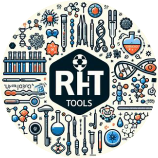

# ResHelp Tools



ResHelp Tools is a comprehensive toolkit designed to assist researchers in various tasks related to chemical data processing, docking simulations, and more. With a user-friendly interface and powerful functionalities, ResHelp Tools streamlines the workflow of researchers, making their work more efficient and productive.

## Features

- **PubChem Database Interaction:** Easily access and retrieve chemical data from the PubChem database.
- **IMPPAT Integration:** Fetch phytochemical associations and therapeutic use data using the IMPPAT database.
- **Add Hydrogen Tool:** Automatically add hydrogen atoms to SDF files and convert them to PDB format for molecular simulations.
- **Docking Automation:** Automate the docking process using OpenBabel and AutoDock Vina for molecular docking studies.

## Installation

To install ResHelp Tools on your system, follow these steps:

1. **Clone the Repository:** Begin by cloning the ResHelp Tools repository to your local machine:

    ```bash
    git clone https://github.com/ResTools-Developer/ResHelp-Tools.git
    ```

2. **Navigate to the Directory:** Move into the cloned directory:

    ```bash
    cd ResHelp-Tools
    ```

3. **Install Dependencies:** Install the required Python dependencies by running:

    ```bash
    sudo ./setup.sh
    ```
    This is a required step. Without this, the programs wont work.

4. **Update:** To get latest changes and updates to the program

    cd to the Repository folder in your system

    ```bash
    git pull
    ```

## Usage

Follow these steps to use ResHelp Tools effectively:

1. **Run the Main Program:**

   Execute the `main.py` file to access the main menu of ResHelp Tools:

   ```bash
   python3 main.py
   ```

2. **Interact with the Tools:**

   - Upon launching the main program, you will be presented with a menu displaying the available actions.
   - Follow the on-screen instructions to perform actions such as selecting files, starting processes, and retrieving data.
   - Use the arrow keys or input the serial number of the action you want to perform.

3. **Docking Process:**

   - When using the docking functionality, ensure that the required ligand and protein files are present in the specified working directory.
   - Follow the prompts to minimize the energy of ligands, convert them to .pdbqt format, start the docking process, and split the output files into docking poses.

4. **Check Software Installation:**

   Before using certain features like docking, verify that OpenBabel and AutoDock Vina are installed on your system. If not, follow the prompts to install them during the first-time setup.

## Requirements

- Python 3.x
- Libraries listed in `requirements.txt`, including OpenBabel, AutoDock Vina, and others.

In the README file, you should include a section that explains the licensing terms of your software. Here's an example of what you can include:

---

## License

This software is distributed under the Apache License, Version 2.0. See the [LICENSE](root/LICENSE) file for details.

### Apache License, Version 2.0

```
Copyright 2024 Manav Amit Choudhary

Licensed under the Apache License, Version 2.0 (the "License");
you may not use this file except in compliance with the License.
You may obtain a copy of the License at

    http://www.apache.org/licenses/LICENSE-2.0

Unless required by applicable law or agreed to in writing, software
distributed under the License is distributed on an "AS IS" BASIS,
WITHOUT WARRANTIES OR CONDITIONS OF ANY KIND, either express or implied.
See the License for the specific language governing permissions and
limitations under the License.
```

## Acknowledgements

- **Developer:** Manav Choudhary

## HariOm
